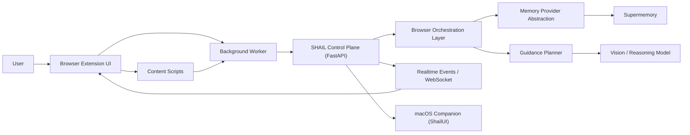
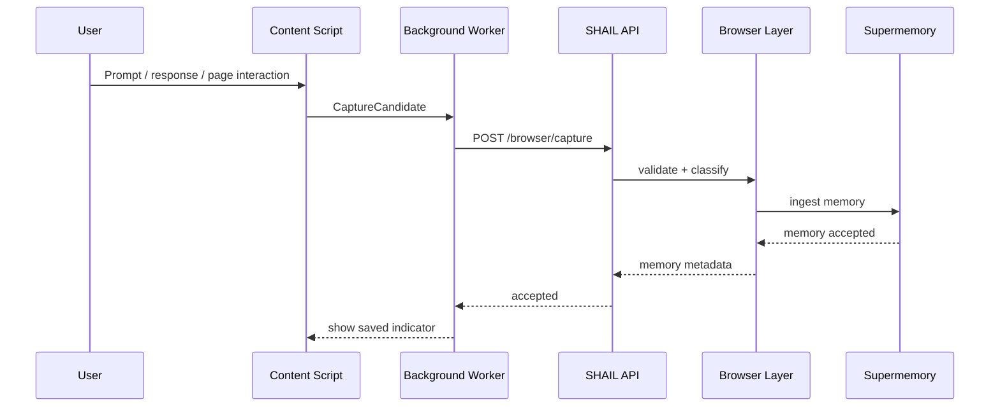

# SHAIL Memory Watchdog
## Repo Architecture Plan, Product Architecture, Coordination Model, and SHAIL Reuse Map

**Status:** Product-ready MVP architecture  
**Target:** Chrome extension first, macOS companion second  
**Time horizon:** 4-week MVP with SHAIL-backed control plane  
**Primary outcome:** Ship a memory-native browser copilot that captures useful work context, retrieves it across tools, injects it into AI chatbots, and guides users on supported web apps.

---

## 1. Document Purpose

This document is the source of truth for:

- the target monorepo structure for the MVP
- the runtime product architecture
- how extension, backend, memory, and macOS components coordinate
- which parts of SHAIL should be reused directly
- which parts should be adapted
- which parts must be built fresh for this product

This is intentionally scoped to the **Memory Watchdog MVP**, not the full SHAIL operating system vision.

---

## 2. Product Boundary

### 2.1 What this MVP is

The MVP is a **browser-first memory and guidance layer** that:

- captures meaningful interactions on supported AI chatbots and web apps
- stores summarized context in a memory backend
- retrieves past context semantically
- injects memory back into supported chatbots and workflows
- provides an inline quick-query assistant
- guides the user with a blue shadow cursor and step text on supported DOM-based sites

### 2.2 What this MVP is not

The MVP is not:

- a general autonomous browser agent
- a universal desktop automation platform
- a fully self-building SHAIL runtime
- a Windows-first product
- a full team collaboration suite

### 2.3 Core product wedge

The wedge is:

- **AI power users**
- using **ChatGPT, Claude, Gemini, and Perplexity**
- who want **persistent context and instant recall**
- plus **lightweight browser guidance**

---

## 3. Architecture Principles

### 3.1 Product principles

- **Memory-first:** the system should feel useful because it remembers and retrieves, not because it looks agentic.
- **Assist before automate:** guidance comes before autonomous execution.
- **Scoped trust:** users must understand what is captured, stored, and reused.
- **DOM-first grounding:** guidance should target real DOM elements when possible.
- **Reuse SHAIL where it already has leverage:** tasking, approvals, websocket state, macOS launcher patterns.

### 3.2 Engineering principles

- **Keep the MVP monorepo-simple.** Do not add unnecessary microservices.
- **Make the extension thin but capable.** Parsing and UI in the extension; orchestration and policy in backend.
- **Keep memory backend swappable.** Use a provider abstraction instead of hard-coding Supermemory everywhere.
- **Use typed contracts.** Shared request/response schemas for extension, backend, and mac companion.
- **Separate ingestion from retrieval.** Capture can be noisy; recall must be clean and fast.

---

## 4. Recommended Monorepo Plan

The current repo already contains:

- `apps/shail` for FastAPI backend
- `apps/shail-ui` for the current web dashboard
- `apps/mac/ShailUI` for the macOS companion shell
- `shail/` for orchestration, safety, memory, tools, and integrations
- `services/` for supporting service modules

For this MVP, the recommended target structure is:

```text
jarvis_master/
  apps/
    browser-extension/
      package.json
      wxt.config.ts
      public/
        icon-16.png
        icon-32.png
        icon-48.png
        icon-128.png
      entrypoints/
        background.ts
        content/
          universal.ts
          sites/
            chatgpt.ts
            claude.ts
            gemini.ts
            perplexity.ts
        popup/
          index.html
          main.tsx
        options/
          index.html
          main.tsx
        sidepanel/
          index.html
          main.tsx
      src/
        components/
        features/
          capture/
          search/
          injection/
          guidance/
          settings/
        lib/
          api/
          contracts/
          permissions/
          storage/
          telemetry/
        overlays/
          quick-query/
          guide-cursor/
          capture-indicator/
        site-adapters/
          base/
          chatgpt/
          claude/
          gemini/
          perplexity/
          generic-dom/
    mac/
      ShailUI/
        ...
    shail/
      main.py
      websocket_server.py
      settings.py
  docs/
    SHAIL_MEMORY_WATCHDOG_ARCHITECTURE.md
  shail/
    browser/
      contracts/
      events/
      ingestion/
      retrieval/
      injection/
      guidance/
      providers/
        memory/
          base.py
          supermemory.py
      policies/
        capture_policy.py
        supported_sites.py
      telemetry/
        browser_audit.py
  tests/
    browser/
      backend/
      site_adapters/
      guidance/
  scripts/
    dev/
      start_browser_mvp.sh
```

### 4.1 Why this structure

- `apps/browser-extension` contains all browser runtime UI and MV3 logic.
- `apps/shail` remains the single MVP control plane rather than spawning a new backend.
- `shail/browser/*` becomes the product logic layer inside Python, keeping domain logic out of route files.
- `apps/mac/ShailUI` remains the future macOS companion and quick-launch surface.

### 4.2 Framework recommendation

For the extension:

- **WXT + React + TypeScript**

Why:

- Chrome MV3-friendly
- better organization than raw extension scaffolding
- easy support for popup, options, sidepanel, content scripts, and background workers
- clean dev workflow

If the team strongly prefers another stack:

- Plasmo is acceptable
- raw Vite extension setup is acceptable
- WXT is still the cleanest product-ready default

---

## 5. Product Architecture

## 5.1 System overview



### 5.2 Main runtime components

#### A. Browser extension

Owns:

- page observation
- supported-site parsing
- popup and sidepanel UI
- inline quick-query UI
- cursor guidance overlay rendering
- injection into supported chatbot textareas

It should **not** own:

- heavy policy logic
- memory ranking logic
- long-term ingestion rules
- provider-specific memory coupling

#### B. SHAIL control plane

Owns:

- auth/session validation
- orchestration of capture, retrieval, and guidance requests
- provider abstraction for memory backends
- rate limits and user policy checks
- audit and analytics
- websocket event stream for live UI state

#### C. Memory provider abstraction

Owns:

- ingest API calls
- search API calls
- retrieval formatting
- provider-specific failure handling

The system should treat Supermemory as the default provider, but not the only possible provider.

#### D. Guidance planner

Owns:

- current-page grounding payload creation
- DOM element matching
- model prompting for guidance steps
- target ranking
- fallback from DOM selector to pixel coordinates

#### E. macOS companion

Owns:

- global hotkey later
- session visibility outside the browser later
- optional account-level memory search and recent activity feed

For MVP, it is secondary and should not block browser launch.

---

## 6. Runtime Coordination Model

## 6.1 Capture flow

Goal:

- observe useful context without becoming surveillance software

Sequence:

1. User interacts with a supported site.
2. Content script detects a meaningful event.
3. Content script normalizes it into a `CaptureCandidate`.
4. Background worker applies local filtering and dedupe rules.
5. Background worker sends candidate to SHAIL backend.
6. Backend applies server-side capture policy.
7. Backend summarizes and classifies memory.
8. Backend sends normalized memory record to Supermemory.
9. Backend stores local audit metadata and emits a capture event.
10. Extension shows lightweight visual confirmation if enabled.



### 6.2 Search and inject flow

Goal:

- let the user ask for prior context and feed it into the active tool

Sequence:

1. User opens popup or sidepanel.
2. User asks a memory question.
3. Extension sends query to backend.
4. Backend queries Supermemory and composes a `ContextBundle`.
5. Extension renders result cards.
6. User clicks `Send to current chatbot`.
7. Content script resolves the active input box.
8. Injection adapter writes the selected context block.

### 6.3 Quick-query guidance flow

Goal:

- help the user complete the current page workflow

Sequence:

1. User presses `Option + Space`.
2. Quick-query overlay opens near the cursor.
3. User asks a task question.
4. Content script captures current DOM snapshot and optional screenshot reference.
5. Background worker sends guidance request to backend.
6. Backend invokes guidance planner.
7. Planner returns steps, targets, explanations, and fallbacks.
8. Overlay animates the blue shadow cursor to target elements.
9. Text guidance explains what to do and why.

### 6.4 macOS companion flow

Goal:

- later unify browser and native memory access

Sequence:

1. User invokes ShailUI from macOS.
2. ShailUI queries the same SHAIL backend used by the extension.
3. Recent browser memories and current browser task state are shown.
4. In later phases, ShailUI can hand off a query into the extension or receive browser session updates through websocket.

---

## 7. Functional Subsystems

## 7.1 Supported site adapter system

Each supported site gets its own adapter:

- DOM selectors
- event detection logic
- extraction rules
- injection rules
- guidance target helpers

Adapter contract:

- `canHandle(url, document)`
- `extractCaptureCandidate()`
- `resolveComposer()`
- `injectText(payload)`
- `listLikelyTargets()`

This is necessary because AI chat tools have unstable DOMs and different UI conventions.

### Recommended v1 supported adapters

- ChatGPT
- Claude
- Gemini
- Perplexity

### Recommended v1.1 general work apps

- Notion
- Gmail compose
- Linear or Jira read-only guidance
- Google Docs limited guidance

Do not promise broad work-app support until adapter reliability is proven.

## 7.2 Capture policy subsystem

The product needs an explicit capture policy layer.

Capture policy should decide:

- whether this site is allowed
- whether the event type is allowed
- whether the content appears sensitive
- whether screenshot capture is allowed
- whether raw content or only summary may be sent

Suggested policy classes:

- `ALLOW`
- `SUMMARY_ONLY`
- `REQUIRE_CONFIRMATION`
- `DENY`

## 7.3 Memory provider subsystem

This must be an abstraction, not a direct Supermemory dependency spread across the codebase.

Provider interface:

- `ingest_memory(record)`
- `search(query, filters)`
- `get_context_bundle(query, scope)`
- `delete_memory(id)`
- `health_check()`

Default implementation:

- `SupermemoryProvider`

This allows:

- future self-hosted or enterprise variants
- local fallback experiments
- better testability

## 7.4 Guidance subsystem

The guidance subsystem converts page state into actionable UI help.

Inputs:

- normalized page metadata
- URL and app type
- relevant DOM snapshot
- visible element candidates
- optional screenshot reference
- user query
- retrieved memory context

Outputs:

- step list
- target selectors
- target labels
- explanations
- fallback pixel targets
- confidence per step

For MVP:

- DOM selectors are first-class
- screenshot reasoning is a fallback
- guidance is descriptive, not autonomous

## 7.5 Injection subsystem

The injection subsystem is the bridge from memory retrieval to immediate value.

Responsibilities:

- locate supported input area
- insert or append formatted memory block
- preserve user cursor position where possible
- validate that content is visible before returning success

Fallback:

- if direct injection fails, copy to clipboard and prompt the user

---

## 8. Recommended API Surface

All browser-specific routes should be grouped, not mixed loosely into generic chat routes.

### 8.1 New route groups

```text
/browser/health
/browser/capture
/browser/search
/browser/context-bundle
/browser/inject-preview
/browser/guidance
/browser/sites
/browser/settings
/browser/memories/{id}
```

### 8.2 Suggested endpoint behavior

#### `POST /browser/capture`

Accepts:

- source app
- source URL
- capture type
- raw content
- selected text
- screenshot reference
- local metadata

Returns:

- memory id
- status
- summary
- policy flags applied

#### `POST /browser/search`

Accepts:

- query
- filters
- scope

Returns:

- ranked memories
- summary answer
- recommended context block

#### `POST /browser/guidance`

Accepts:

- query
- current page snapshot
- DOM candidates
- current tool/app metadata
- optional memory context

Returns:

- `GuidancePlan`

#### `GET /browser/sites`

Returns:

- supported sites
- capture mode by site
- injection support
- guidance support

---

## 9. Data Contracts

## 9.1 CaptureCandidate

```json
{
  "sourceApp": "claude",
  "sourceUrl": "https://claude.ai/...",
  "eventType": "chat_turn",
  "title": "Claude conversation",
  "userText": "How should I price this SaaS?",
  "assistantText": "You could price by seat...",
  "selectedText": "",
  "timestamp": "2026-04-11T12:00:00Z",
  "pageContext": {
    "workspace": "default",
    "tabTitle": "Claude",
    "siteRole": "ai_chatbot"
  }
}
```

## 9.2 MemoryRecord

```json
{
  "memoryId": "mem_123",
  "userId": "usr_123",
  "sourceApp": "claude",
  "memoryType": "conversation",
  "summary": "Pricing discussion for SHAIL Memory Watchdog",
  "tags": ["pricing", "saas", "mvp"],
  "rawContentRef": "provider://supermemory/...",
  "confidence": 0.93,
  "createdAt": "2026-04-11T12:00:02Z"
}
```

## 9.3 ContextBundle

```json
{
  "query": "find my old pricing strategy conversation",
  "answer": "You discussed mid-ticket pricing and high-touch onboarding...",
  "items": [],
  "injectionText": "Relevant prior context:\\n- You previously decided...",
  "citations": [
    {
      "memoryId": "mem_123",
      "sourceApp": "claude",
      "timestamp": "2026-04-10T09:20:00Z"
    }
  ]
}
```

## 9.4 GuidancePlan

```json
{
  "query": "how do I export this report?",
  "steps": [
    {
      "order": 1,
      "instruction": "Open the report action menu in the top-right toolbar.",
      "why": "That menu contains export actions for this page.",
      "target": {
        "selector": "[data-testid='report-actions']",
        "fallbackBox": [1210, 86, 1280, 124],
        "label": "Report actions"
      },
      "confidence": 0.89
    }
  ],
  "mode": "guided",
  "audioRecommended": false
}
```

---

## 10. Product Coordination Details

## 10.1 Extension responsibility split

### Content scripts

Responsible for:

- site-specific DOM observation
- extraction of visible context
- rendering overlays
- DOM injection

Not responsible for:

- memory ranking
- policy decisions
- long-term storage strategy

### Background worker

Responsible for:

- request batching
- network calls
- auth token storage
- feature flags
- local dedupe and retry queue

### Popup and sidepanel

Responsible for:

- search UI
- memory browsing UI
- actions: inject, copy, pin, delete

## 10.2 Backend responsibility split

### Route layer

Responsible for:

- validation
- auth
- request/response shaping

### Browser domain layer

Responsible for:

- capture policy
- provider dispatch
- result formatting
- guidance orchestration

### Persistence layer

Responsible for:

- local audit metadata
- user preferences
- supported-site configs

The backend should not duplicate full memory storage if Supermemory is the system of record.

---

## 11. Reuse from SHAIL vs Build Fresh

This section is the most important implementation map.

## 11.1 Reuse directly

These components are already directionally correct and should be reused with minimal structural change.

| Area | Current path | Reuse decision | Why |
|---|---|---|---|
| FastAPI control plane | `/Users/reyhan/jarvis_master/apps/shail/main.py` | Reuse directly | Already provides tasking, approval patterns, and API structure |
| Websocket event streaming | `/Users/reyhan/jarvis_master/apps/shail/websocket_server.py` | Reuse directly | Good basis for live guidance state and browser/mac sync |
| App settings pattern | `/Users/reyhan/jarvis_master/apps/shail/settings.py` | Reuse directly | Centralized config model already exists |
| Permission patterns | `/Users/reyhan/jarvis_master/shail/safety/permission_manager.py` | Reuse directly | Strong model for future guidance-to-action approvals |
| MCP registration pattern | `/Users/reyhan/jarvis_master/shail/integrations/register_all.py` | Reuse directly | Useful for future browser tools and provider abstractions |
| macOS app shell | `/Users/reyhan/jarvis_master/apps/mac/ShailUI/ShailApp.swift` | Reuse directly | Strong base for global launcher / companion |
| macOS websocket client pattern | `/Users/reyhan/jarvis_master/apps/mac/ShailUI/BackendWebSocketClient.swift` | Reuse directly | Useful for live session sync |

## 11.2 Reuse, but adapt heavily

These components have relevant ideas or scaffolding, but should not be adopted unchanged.

| Area | Current path | Decision | Adaptation required |
|---|---|---|---|
| Existing SHAIL memory modules | `/Users/reyhan/jarvis_master/shail/memory/*` | Adapt heavily | Use for metadata/audit and local preferences, not as primary long-term memory store |
| Existing RAG approach | `/Users/reyhan/jarvis_master/docs/RAG_MEMORY.md` | Adapt heavily | Replace primary vector ownership with provider abstraction over Supermemory |
| Vision/perception layer | `/Users/reyhan/jarvis_master/shail/perception/*` | Adapt heavily | Re-scope to browser guidance grounding, not full desktop perception |
| Existing web dashboard | `/Users/reyhan/jarvis_master/apps/shail-ui/*` | Adapt heavily | Reuse visual language and approval patterns, but browser extension needs dedicated UI |
| Tool/adapters model | `/Users/reyhan/jarvis_master/shail/integrations/*` | Adapt heavily | Useful conceptual model for site adapters and memory providers |
| Router/orchestration model | `/Users/reyhan/jarvis_master/shail/orchestration/*` | Adapt heavily | Keep simple for MVP; avoid dragging full SHAIL graph complexity into browser capture flow |

## 11.3 Build fresh

These are product-specific and should be built specifically for the Memory Watchdog MVP.

| Area | Build fresh path | Why fresh build is required |
|---|---|---|
| Browser extension shell | `apps/browser-extension/*` | No existing browser runtime exists in the repo |
| Supported-site adapters | `apps/browser-extension/src/site-adapters/*` | AI chatbot DOM parsing and injection are product-specific |
| Browser overlay renderer | `apps/browser-extension/src/overlays/*` | Ghost cursor and quick-query UX are new product primitives |
| Browser capture policy | `shail/browser/policies/capture_policy.py` | Current SHAIL permissions are action-oriented, not memory-capture-oriented |
| Supermemory provider | `shail/browser/providers/memory/supermemory.py` | Needs a dedicated provider abstraction |
| Browser domain service layer | `shail/browser/*` | Product-specific backend boundary is cleaner than stuffing logic into existing modules |
| Context injection formatter | `shail/browser/injection/*` | Needs chatbot-aware formatting and output modes |
| Browser analytics and audit model | `shail/browser/telemetry/*` | Product-specific measurement, privacy, and eventing model |

## 11.4 Do not reuse for MVP

These current SHAIL areas are out of scope and should not influence MVP implementation.

| Area | Current path | Why not reuse |
|---|---|---|
| Windows automation bridge | `/Users/reyhan/jarvis_master/native/win/*` | Incomplete and irrelevant to browser-first MVP |
| Voice capture stack | `/Users/reyhan/jarvis_master/shail/interfaces/voice/*` | Not production-ready for MVP; avoid blocking launch |
| Robotics / STEM adapters | `/Users/reyhan/jarvis_master/shail/integrations/tools/*` | Orthogonal to browser memory product |
| Broad multi-agent SHAIL OS scope | `/Users/reyhan/jarvis_master/shail/orchestration/*` | Too large for MVP unless selectively reused |

---

## 12. Implementation Work Packages

## WP1: Browser extension foundation

- scaffold `apps/browser-extension`
- auth/session bootstrap
- background worker
- popup and options shell
- supported site detection

## WP2: Memory capture

- AI chatbot adapters
- capture normalization
- local dedupe
- backend `/browser/capture`
- Supermemory ingest provider

## WP3: Search and inject

- popup search experience
- backend `/browser/search`
- context bundle formatting
- injection adapters for supported sites

## WP4: Guidance

- quick-query overlay
- backend `/browser/guidance`
- DOM target ranking
- blue shadow cursor animation
- step text rendering

## WP5: macOS companion bridge

- surface recent browser session state in ShailUI
- optional quick launcher handoff to browser session

## WP6: Trust and readiness

- per-site controls
- memory deletion
- audit event log
- privacy copy
- instrumentation

---

## 13. Delivery Milestones

### Week 1

- extension shell
- auth
- supported-site detection
- backend browser routes scaffold

### Week 2

- memory capture on AI chatbots
- search and retrieval
- context injection

### Week 3

- quick-query overlay
- DOM guidance
- top-3 supported workflow demos

### Week 4

- privacy controls
- polish
- macOS companion sync
- internal alpha

---

## 14. Biggest Architecture Risks

### Risk 1: Over-collecting noisy browser data

Mitigation:

- capture only meaningful events
- restrict by supported sites
- use policy gating before storage

### Risk 2: DOM adapter brittleness

Mitigation:

- create per-site adapter tests
- maintain fallback selector strategy
- visibly mark unsupported pages

### Risk 3: Memory backend lock-in

Mitigation:

- build provider abstraction from day one

### Risk 4: Guidance quality drift

Mitigation:

- DOM-first targeting
- confidence thresholds
- user-visible fallbacks

### Risk 5: Pulling too much SHAIL scope into MVP

Mitigation:

- browser-first wedge only
- no full desktop automation in MVP
- only selective SHAIL reuse

---

## 15. Final Recommendation

The cleanest path is:

1. Keep `apps/shail` as the control plane.
2. Add a dedicated `apps/browser-extension` product app.
3. Add a focused `shail/browser/*` backend domain layer.
4. Reuse SHAIL’s API/websocket/mac shell patterns.
5. Do not drag the full SHAIL OS abstraction into the MVP.

This gives the team:

- a product that can ship fast
- a repo structure that can grow cleanly
- a clear separation between browser product logic and broader SHAIL vision
- a realistic bridge from browser MVP to later macOS-wide SHAIL expansion

---

## 16. Suggested Immediate Next Files

If implementation starts now, create these first:

```text
apps/browser-extension/package.json
apps/browser-extension/wxt.config.ts
apps/browser-extension/entrypoints/background.ts
apps/browser-extension/entrypoints/content/sites/chatgpt.ts
apps/browser-extension/src/lib/api/client.ts
apps/browser-extension/src/lib/contracts/browser.ts
shail/browser/providers/memory/base.py
shail/browser/providers/memory/supermemory.py
shail/browser/policies/capture_policy.py
shail/browser/ingestion/service.py
shail/browser/retrieval/service.py
shail/browser/guidance/service.py
```

These files establish the correct architecture without locking the team into premature complexity.
